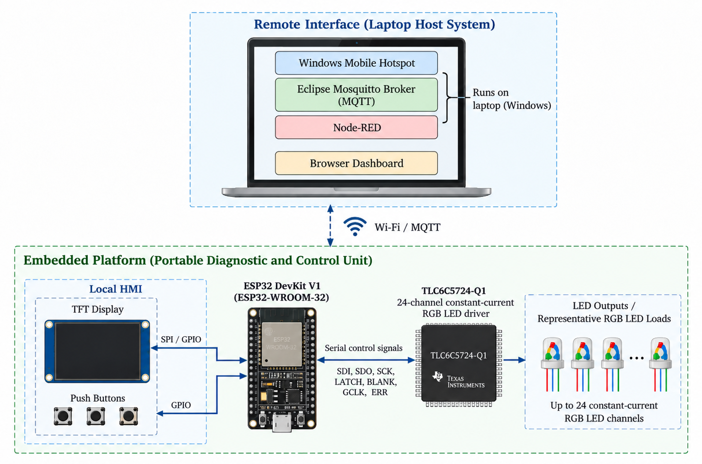
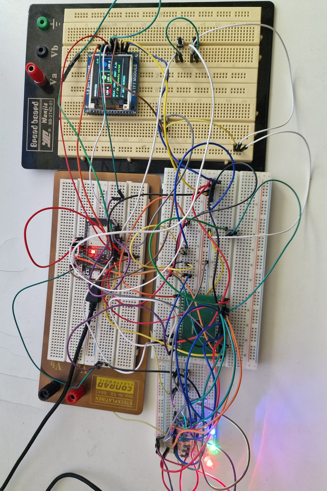
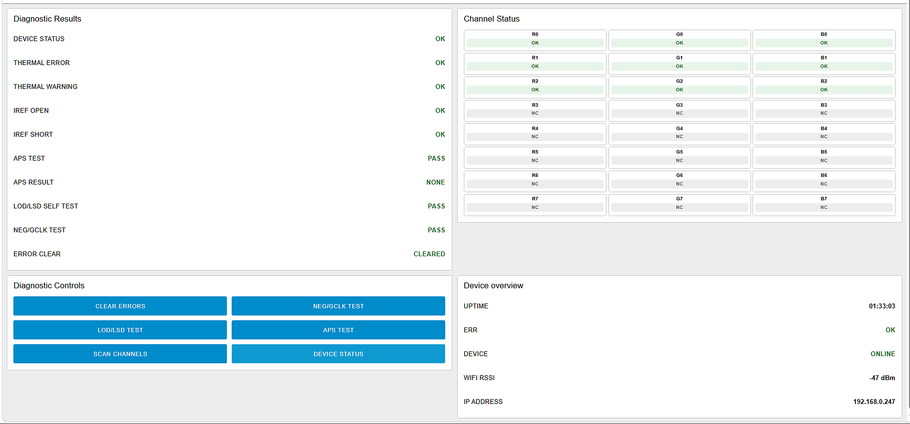
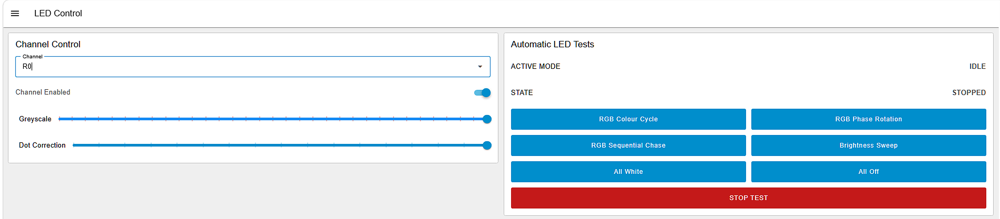

# Portable Automotive RGB Lighting Diagnostic Platform

**Development and Validation of a Portable Automotive RGB Lighting Diagnostic Platform Using the TLC6C5724-Q1 Automotive LED Driver with Local Control and MQTT-Based Remote Monitoring through Node-RED**

University project, OTH Regensburg (2026) - Pratik Sukare

An ESP32-based test and control unit for the Texas Instruments **TLC6C5724-Q1**, a 24-channel constant-current RGB LED driver for automotive lighting. The platform drives all 24 outputs, runs the driver's built-in diagnostics, and reports faults both on a local TFT display and on a remote Node-RED dashboard over MQTT.

## Features

- **Driver interface:** SPI-based serial control of the TLC6C5724-Q1 with separate LATCH, GCLK/BLANK PWM timing and the ERR fault line
- **Diagnostics:** LED open/short (LOD/LSD), short-to-ground, adjacent-pin short (APS), IREF open/short, thermal warning and over-temperature, LOD/LSD self-test, NEG/GCLK integrity test, device status, raw SID readout, error clear
- **Validated under controlled fault conditions:** open and shorted LEDs, short-to-ground, adjacent-pin shorts and IREF faults are detected as expected
- **Non-blocking firmware:** no long delays in the main loop; MQTT commands are queued as pending commands and executed by the main loop; automatic LED tests run as a state machine
- **Six automatic LED tests:** RGB colour cycle, RGB phase rotation, sequential chase, brightness sweep, all white, all off
- **Local HMI:** 128x160 SPI colour TFT and three push buttons - works without any network
- **Remote monitoring:** Eclipse Mosquitto + Node-RED Dashboard 2 with a diagnostics page and a per-channel LED control page (grayscale, dot correction)
- **Network recovery:** retries saved Wi-Fi profiles, and returns to the preferred hotspot if the MQTT broker is unreachable

| Prototype | Node-RED diagnostics |
|---|---|
|  |  |

## Repository layout

| Path | Contents |
|---|---|
| `firmware/TLC6C5724_Diagnostic_Controller/` | ESP32 Arduino sketch, split by module (see below) |
| `node-red/flows.json` | Node-RED Dashboard 2 flow (import via *Menu > Import*) |
| `hardware/` | KiCad schematics (plus a PDF export) of the prototype, and the TLC breakout schematic and PCB layout |
| `mosquitto/` | Mosquitto demo config and a Windows launcher that starts Mosquitto and Node-RED and opens the dashboard |
| `docs/images/` | Architecture, prototype and dashboard figures |

Firmware modules:

- `TLC6C5724_Diagnostic_Controller.ino` - declarations and setup / main loop
- `TlcDriver.ino` - TLC frame building, serial transfer, GS/DC/BC configuration
- `Diagnostics.ino` - channel diagnostics, APS, IREF/device status, LOD/LSD, NEG/GCLK, SID debug
- `AutoTests.ino` - automatic RGB / phase / chase / brightness / static tests
- `NetworkMqtt.ino` - Wi-Fi profiles, MQTT commands, status publishing, recovery
- `DisplayUi.ino` - TFT pages and menu navigation
- `Buttons.ino` - push-button input
- `ProjectConfig.h` - MQTT topics, timing constants

## Build

1. Arduino IDE with the **ESP32** board package (board: ESP32 Dev Module).
2. Libraries: **PubSubClient**, **TFT_eSPI** (configure `User_Setup.h` for the 1.8" 128x160 SPI TFT used).
3. Copy `Secrets.example.h` to `Secrets.h` and enter your Wi-Fi and broker settings. `Secrets.h` is git-ignored.
4. On the laptop: install Mosquitto and Node-RED with `@flowfuse/node-red-dashboard`, import `node-red/flows.json`, then run `mosquitto/TLC6C5724_Demo_Start.bat` to start the broker and Node-RED and open the dashboard.

## References

- Texas Instruments, *TLC6C5724-Q1 Automotive 24-Channel, Full Diagnostics, Constant-Current RGB LED Driver*, datasheet
- Eclipse Mosquitto, Node-RED and Node-RED Dashboard 2.0 documentation

## License

MIT - see [LICENSE](LICENSE). Third-party code (e.g. ST HAL/CMSIS drivers, libraries) keeps its own license.
